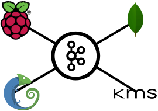

# CINI SMART CITY UNIVERSITY CHALLENGE 2019 

# Encryption System over Broker

A. Filimon, C.Irwin, D.Ciarlo, E.Barison, M.Cosentino

Università del Piemonte Orientale, sede di Alessandria, C.so di Laurea in Informatica

## Abstract

Lo scopo del nostro progetto è quello d'impedire la raccolta di dati, non autorizzata, nelle reti di dispositivi **IoT** che comunicano attraverso un broker,  siano queste reti di tipo domestico, industriale o cittadino.
L'architettura adottata è basata un _Key Managmet System_ (KMS) che attraverso dei layer software sui vari dispositivi connessi alla rete può  garantire la segretezza delle informazioni trasmesse, sia per quanto riguarda la riservatezze del dato in se, sia per quanto riguarda una possibile azione di data mining di terze parti.
Per far ciò utilizza un sistema automatico, basato sul tempo, per il rinnovo di chiavi simmetriche e ID.

------

## 1. Introduzione

Secondo dati raccolti dall'_Osservatorio linternt of Things_ della School of Management del Politecnico di Milano[^1] Il mercato del IoT, in Italia nel 2018, è cresciuto del 35% con il settore _Smart Home_ in aumento del 52% e quello _Smart City_ in aumento del 36% grazie all'impegno dei comuni che hanno avviato progetti in questo ambito.
La costruzione e la gestione delle nuove reti che utilizzano l' IoT può essere difficoltosa, il 62% dei progetti _Smart City_ si ferma per problematiche legate ai costi di implementazione[^1]. D'altro canto le piattaforme che offrono la gestione delle reti IoT, non sono sempre sicure e chiare sulla raccolta di dati ed il loro successivo utilizzo. Questo limita i possibili guadagni che si possono ricavare vendendo in prima persona le informazioni, e la riservatezza delle stesse.

Pare quindi ovvia la necessità di gestire i dati di queste reti in maniera performante, sicura ma con costi d'implementazione contenuti.
Il nostro sistema utilizzando le moderne tecnologie per l' _Internet of Things_[^3] e protocolli crittografici sicuri[^2] insieme a un meccanismo automatico di rinnovo delle chiavi simmetriche basato sui _TimeToLive_ (TTL), si pone come obbiettivo quello di garantire:

- Prestazioni in linea con lo standard IoT.
- Un costo implementativo basso.
- Una facile gestione.
- La riservatezza e il corretto funzionamento della rete nonostante essa si appoggi a servizi di terze parti.
- La possibilità di gestire i permessi di lettura e di scrittura per ogni attore della rete.
- L'impossibilità di effettuare _Data Mining_ occulto.

È stato sviluppato un sistema composto da un **KMS** e due layer software che gestiscono la comunicazione con i device IoT(**D**) e con il **DB** attraverso il broker _Kafka_. 
Il sistema ha due implementazioni differenti:

Nella prima abbiamo il device **D** che non svolge alcuna elaborazione in locale, ma si limita a utilizzare le API REST per comunicare con il resto del sistema.
Nel secondo caso **D** è provvisto del proprio layer software e quindi comunica con il broker in autonomia.
Il funzionamento del sistema rimane identico in entrambe le implementazioni tranne per il fatto che non possiamo garantire la sicurezza del canale da **D** alle API.

### 1.1 Assunzioni

Per la progettazione ci siamo immaginati una situazione ostile dove l'unico elemento realmente sicuro è il **KMS** mentre il broker, i vari device e il database sono potenziali attaccanti che mirano: a impedire il corretto funzionamento della rete o a raccogliere dati e metadati da inviare a terze parti.
Quindi abbiamo ipotizzato che:

- Il broker può permettere l'ingresso sia in lettura che in scrittura su tutti i topic a elementi non appartenenti alla rete.
- Il broker non può impedire la pubblicazione quindi mantiene un certo quality of service che lo rende apparentemente sicuro
- Il DB può non essere sicuro e permettere l'ascesso ai non autorizzati
- Il DB può non rispondere correttamente alle richieste di visualizzazione dati
- Il server dove è situato il KMS è un server sicuro

## 2.Architettura

Il sistema è stato progettato per rispettare lo standard corrente per quanto riguarda i sistemi IoT[^3] e per poter essere facilmente implementabile. Si appoggia quindi su un architettura basata su _Message Broker_ nello specifico _Kafka_[^4], un broker altamente scalabile, su un DB non relazionale, _MongoDB_[^5] e su dei layer di codice _Java_ che gestiscono la comunicazione e implementano _AES_[^9] e _SSL_[^10].
Per l'implementazione "locale" vengono utilizzati dei _raspberry_ pi zero[^6], scelti per il loro costo ridotto e la possibilità di sfruttare le primitive di encryption, dei processori ARM, per future migliorie nell'ambito delle performance.
L'implementazione "remota" utilizza una virtual machine _Chameleon_[^7] incaricata di gestire tutte le richieste tramite API REST, inoltre rende possibile alle 2 diverse implementazioni di coesistere in una struttura mista.

Affinché i meccanismi di encryption/decryption basati sul TTL funzionino è necessario che i device che svolgono suddette funzioni abbiano lo stesso clock, quindi durante le procedure di login questi sincronizzeranno i propri clock a quello del **KMS** utilizzando il protocollo _PTP_[^8], scelto per via della sua precisione nella sincronizzazione, sotto i 100 nanosecondi, che ci permette una gestione migliore delle richieste.

### 2.1 Struttura del messaggio

I messaggi sono in formato _.json_ e possono essere di due tipi

- **Gestione**:
  Composti da un ID in chiaro, la firma del messaggio, e un campo criptato con una chiave simmetrica, contiene i dati utilizzati per il login o lo scambio di chiavi. 
- **Dato**:
  Composti da un ID in chiaro (firma) e due campi criptati, _head_ e _body_, nel primo possiamo trovare l'hash del _body_ e il numero di sequenza del messaggio.
  Come è possibile intuire l'hash e il numero di sequenza vengono utilizzati per garantire la veridicità del messaggio, in più questo ci permette di non sprecare tempo computazionale per decriptare il campo _body_ contenente il vero e proprio messaggio. In questo modo insieme a un sistema di alert collegato alla dashboard dell'amministratore è possibile prevenire attacchi di tipo DDoS alla rete.

### 2.2 Chiavi

Le chiavi utilizzate dal sistema possono essere:

- **Asimmetriche**:
  Utilizzate durante il primo login a chiave pubblica.
- **Simmetriche**:
  Utilizzate per l'encryption dei messaggi, dei dati e per il rinnovo del login.

### 2.3 ID e AliasID

L'**ID** e **l'AliasID** sono campi di tipo int con lunghezza variabile in base alla grandezza della rete che il sistema dovrà gestire.

Per la gestione delle varie procedure ogni messaggio viene firmato con l’ ID del mittente. Per impedire un'associazione ID - device questi vengono aggiornati insieme alla loro _Simmetric Session Key_ (SSK) durante ogni procedura di login e rinnovo login, quindi in differenti momenti per ogni attore.

Il **KMS** invece per scambiare messaggi con un attore, durante le procedure di login fornisce un vettore **AliasID**, contente gli ID con cui il KMS firmerà i messaggi destinati ad esso.

Immaginando quindi un possibile attaccante che è in grado di vedere tutti i messaggi che passano sui vari topic del broker, risulta estremamente difficile, non solo, che lui possa decifrare i dati in transito ma anche solamente fare una qualsiasi altra analisi sulla rete, come potrebbe essere capire da quanti attori è composta. 

Lo stesso discorso vale anche per quanto riguarda un attaccante che ha accesso al DB, infatti quello che vedrà sarà solo il dato criptato, il timestamp dell'encryption e l'ID di chi ha pubblicato il dato, essendo l'ID variabile e senza alcun tipo di associazione non riuscirà a ricavare nessuna informazione utile.

### 2.4 Dashboard

- Screen Demo della dashboard

## 3. Funzionamento

### 3.1 Chiavi simmetriche

Le chiavi simmetriche che il sistema utilizza sono:

- SSK(_Simmetric Session Key_): chiave utilizzata per comunicare con il **KMS**.
- SMDK (_Simmetric Master Data Key_): chiave che periodicamente espansa (a seconda dell'impostazione del sistema) genera ad ogni volta una nuova chiave SDK.
- SDK (_Simmetric Data Key_): chiave utilizzata per criptare il dato vero e proprio.
- SDBK(_Simmetric DB Key_): chiave generata dal **KMS** e distribuita a **D** e al **DB** affinché la pubblicazione di dati sia segreta.

Tutte sono basate sul TTL ed hanno una gerarchia di esistenza:
$$
TTL_{SDBK}<TTL_{SDK}<TTL_{SMDK}<TTL_{SSK}
$$

> Una chiave SDBK si aggiorna _N_ volte durante il TTL di una chiave SDK, così come anche una chiave SMDK rispetto a una SSK.

### 3.2 Autenticazione

Ogni attore dovrà essere provvisto di: un username, una password e un certificato contente la propria _Public_KEY_, la _Public_KEY_ del **KMS** e l’ID di default, che dovrà inviare al KMS per potersi autenticare al sistema.
Se un attore non possiede una chiave SSK valida da rinnovare dovrà autenticarsi con la funzione di login a chiave pubblica:

Nel caso invece questo sia provvisto di una chiave SSK valida, quindi avendo già fatto almeno un login, che implica avere un vettore di AliasID, prima che il TTL di questa scada verrà rinnovata in automatico utilizzando la funzione di loginSSK.

Una volta ricevuti i nuovi dati per la comunicazione l'attore provvederà a confermare la transazione pubblicando un messaggio criptato con la nuova chiave SSK. 

 Secondo la logica del sistema, dopo che un attore si è autenticato la prima volta non dovrà più utilizzare la funzione di login a chiave pubblica quindi ogni volta che questa procedura viene effettuata l'amministratore verrà informato con un alert sulla sua dashboard.

### 3.3 Pubblicazione

Un device **D** prima di poter pubblicare su un topic dovrà contrattare le chiavi necessarie con il **KMS**, il quale procederà al controllo dei suoi permessi di scrittura e nel caso la richiesta sia valida, distribuirà le chiavi e i TTL a **D** e al **DB**.

Ogni volta che il **DB** salva con successo un messaggio invia un ACK al **KMS** che provvede a incrementare un contatore associato alla chiave SMDK che verrà utilizzato in seguito per validare la risposta del **DB**.

### 3.4 Lettura

Quando **D** intende fare una lettura dei dati salvati sul **DB** invia una richiesta al **KMS**, specificando topic e intervallo di tempo dei dati che si desidera leggere. Dopo aver controllato i  permessi di **D** il **KMS** distribuisce le chiavi, i TTL e tutte le informazioni necessarie per le procedure di lettura. 

**D** una volta validati i pacchetti con i metodi sopracitati, espanderà la chiave SDBK quanto necessario per leggere e visualizzare ogni dato:
$$
\Delta = timestampCryp - timestampGen
$$

$$
N = \frac {\Delta - (\Delta \mod TTL_{SDK})}{TTL_{SDK}}
$$

$$
N= NumeroEspansioni
$$

Se i dati restituiti dal **DB** non coincidono numericamente con il counter della chiave SDBK viene inviato un alert alla dashboard dell'amministratore poiché è possibile che il **DB** sia compromesso.

### 3.6 Benchmark e conclusioni

// benchmark non ancora disponibili

In conclusione **E.S.B.** se implementato su un hardware adeguato, che non necessariamente vuol dire al top delle performance, e con una giusta e sapiente configurazione dei vari TTL può rendere una rete basata su broker sicura senza intaccare eccessivamente le performance, indipendentemente dalle dimensioni della stessa.

## 4.Requisiti

### 4.1 Requisiti funzionali

- Il sistema deve garantire la sicurezza dei dati che i vari attori pubblicano sul broker.
- Il sistema deve garantire l'impossibilità da parte di terzi di svolgere data minig e statistiche basandosi sui dati e i metadati degli attori (numero e frequenza dei messaggi pubblicati, topic di pubblicazione, ecc).
- Il sistema deve garantire che i dati non siano leggibili da terze parti sprovviste di autorizzazione.
- Il sistema deve garantire che solo e soltanto il **DB** salvi i dati pubblicati sul broker.
- Il sistema deve permettere la visualizzazione dei dati tramite dashboard web.
- Il sistema deve permette di gestire i permessi di lettura e scrittura di ogni device **D** appartenete alla rete.
- Il sistema deve permettere l'aggiunta di nuovi **D** solo all'amministratore.
- Il sistema deve essere utilizzabile tramite API REST.

### 4.2 Requisiti non funzionali

- Il sistema deve essere "resistente" a i più comuni attacchi. (DDoS, Man in the middle, ecc)
- Il sistema deve garantire che il **DB** risponda correttamente a tutte le richieste di lettura
- Il sistema deve essere in grado di capire se nella rete è presente un attore malintenzionato
- Il sistema per garantire performance e il minor numero di errori possibili per quanto riguarda le procedure di encryption/decryption manterrà il clock dei attori sincronizati con un scarto massimo di 1000 nanosecondi.
- Il server su cui risiede il KMS deve essere sicuro e gestito dall'amministratore del sistema o comunque da personale autorizzato.

## 5. Sviluppi futuri

- Sistema di ottimizzazione automatica dei TTL.
- Sistema di alert all'amministratore in caso di comportamenti anomali da parte del sistema.
- Utilizzare accelerazione hardware per svolgere le funzioni di encryption/Decryption.
- Gestione ottimizzata dello streaming video.
- Gestione ottimizzata dei comandi per sensori IoT

## 6. REST API

- **Login**

  |                |      |
  | -------------- | ---- |
  | **Url**        |      |
  | **Method**     |      |
  | **Parameters** |      |

  > Richiama la funzione di login a chiave pubblica descritta nella sezione 3.2 della documentazione

- **LoginSSK**

  |                |      |
  | -------------- | ---- |
  | **Url**        |      |
  | **Method**     |      |
  | **Parameters** |      |

  > Richiama la funzione di login a chiave simmetrica descritta nella sezione 3.2 della documentazione

- **Write**

  |                |      |
  | -------------- |:----:|
  | **Url**        |   xxx   |
  | **Method**     |    xxx  |
  | **Parameters** |    xxx  |

  > Richiama la funzione di pubblicazione descritta nella sezione 3.3 della documentazione

- **Read**

  |                |      |
  | -------------- |:----:|
  | **Url**        |   xxx   |
  | **Method**     |   xxx   |
  | **Parameters** |   xxx   |
  

  > Richiama la funzione di letturea descritta nella sezione 3.4 della documentazione

[^1]: Statistica IoT 2019 [https://www.osservatori.net/it_it/osservatori/comunicati-stampa/internet-of-things-italia-mercato](https://www.osservatori.net/it_it/osservatori/comunicati-stampa/internet-of-things-italia-mercato)
[^2]: Stato dell'arte della crittografia [https://pdfs.semanticscholar.org/5d08/2c65275f45159a88548589492103ff82fc01.pdf](https://pdfs.semanticscholar.org/5d08/2c65275f45159a88548589492103ff82fc01.pdf)
[^3]: Samtani, G.; Sadhwani, D. (2013). "Integration Brokers and Web Services". In Clark, M.; Fletcher, P.; Hanson, J.J.; et al. Web Services Business Strategies and Architectures. Apress. pp.71–84. ISBN 9781430253563.
[^4]: Kafka https://kafka.apache.org/
[^5]: MongoDB https://www.mongodb.com/
[^6]: Raspberry https://www.raspberrypi.org/products/raspberry-pi-zero/
[^7]: Chameleon https://www.chameleoncloud.org/
[^8]: PrecusionTimeProtocl https://endruntechnologies.com/pdf/PTP-1588.pdf 
[^9]: AdvancedEncryptionStandard https://www.researchgate.net/publication/317615794_Advanced_Encryption_Standard_AES_Algorithm_to_Encrypt_and_Decrypt_Data
[^10]: SecureSocketsLayer https://www.ibm.com/support/knowledgecenter/en/SSYKE2_7.1.0/com.ibm.java.security.component.71.doc/security-component/jsse2Docs/ssloverview.html